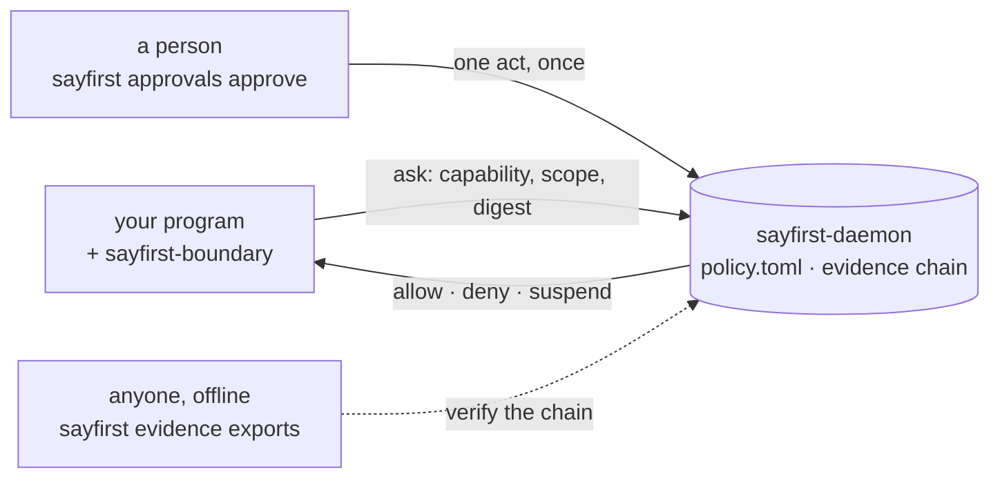

<!-- SPDX-License-Identifier: Apache-2.0 -->
# `sayfirst` — ask before you act

This repository is **the command**. `sayfirst` is the open-source product
command-line interface of the `sayfirst` control plane: it asks the daemon
before an effect, puts the boundary in front of a program that was never
written for it, and reads back and verifies what was decided.

## The 30-second tour

A governed program puts one question to a local control plane before it does
anything that matters: *may I do this, with these arguments, as this account?*

- The daemon answers **allow**, **deny** or **suspend** — from a policy file a
  person can read, over a Unix socket that tells it who is asking from the
  kernel's own credentials. No URL, no token, nothing to leak (article 6).
- **The program never decides.** It asks, and it does only what was allowed:
  the boundary (`sayfirst-boundary`) holds the grant for exactly one execution.
- **A person is in the loop by construction, not by dashboard.** A suspension
  is a wait. `sayfirst approvals approve` ends it once, the deadline comes from
  the policy, and a rejection is final.
- **Every decision leaves a record**, and `sayfirst evidence export` saves a
  bundle a third party verifies offline, with the contract alone.
- **The evidence is honest about itself.** An export of an epoch the daemon has
  not closed verifies « coverage unknown » rather than pretending, and a
  decision a person granted re-derives as « unverifiable », because a policy
  file cannot re-derive a human act.



## Install

`sayfirst-cli` 0.2.0 is on the Python index. As a tool, in an environment of
its own:

```console
$ uv tool install sayfirst-cli==0.2.0
 + sayfirst-boundary==0.2.0
 + sayfirst-cli==0.2.0
 + sayfirst-contract==0.2.0
Installed 1 executable: sayfirst
```

Three distributions arrive and no more: the command, the contract it speaks, and
the boundary a governed program holds its grant in. Never a web framework, never
a database layer — article 13, measured on a real install by
`scripts/check_dependency_closure.py` rather than promised here.
`sayfirst-contract-stub` (a scriptable fake) and `sayfirst-conformance` are on
the index at 0.2.0 as well.

The daemon that answers is `sayfirst-control-plane`, and it is **publishing** —
not on the index as this is written. Build it from a checkout of
[the control plane's repository](https://github.com/fredaime/sayfirst-control-plane),
the way [`QUICKSTART.md`](QUICKSTART.md) does:

```console
$ (cd /path/to/sayfirst-control-plane && uv build --all-packages --out-dir ~/quickstart/wheels)
$ uv pip install --python .venv/bin/python --find-links wheels sayfirst-cli==0.2.0 sayfirst-control-plane==0.2.0
```

## Try it in five minutes

Linux or macOS, Python 3.12, 3.13 or 3.14, and
[`QUICKSTART.md`](QUICKSTART.md), which walks one governed decision end to end:
a policy of two rules, an allow, a suspension, a person's answer, then the chain
read back and exported. Every command on that page was run, in that order, before
it was written down; its answers are pasted from that run. Two of them:

```console
$ .venv/bin/sayfirst ask --capability example.read --scope local --socket $S
verified: true (server_uid 1000, expected 1000)
outcome: allow
reason: policy_allows
$ .venv/bin/sayfirst evidence export --scope local --socket $S --from 1 --out bundle.json
local_check: unverifiable
manifest: recomputes
chain: intact
coverage: unknown
issue: coverage_unknown
```

The `verified:` line is the daemon proving who it is. The second command is the
honesty: that bundle's chain is intact and its manifest recomputes, and it still
answers `unknown`, because its epoch is open.

## What you get — three directions

A client of this control plane does **three** things, and this repository ships
all three. `sayfirst --help` is the claim kept in the dispatch itself; it names
`ask`, `trace`, `explain`, `evidence`, `approvals`, `instrument` and `packs`.

**Before an effect, it asks.** One question — a capability, a scope, optionally
a digest of the arguments — put to the daemon over a socket whose peer it
verified, and one answer rendered as it was given: allow, deny or suspend, and
"could not ask" when the daemon could not be reached. That is `sayfirst ask`.

**It puts the boundary in front of somebody else's program.** `sayfirst
instrument run --pack DIR … -- <program>` runs a program with the named effects
asked about first, reversibly and writing nothing anywhere; `instrument verify`
runs it again under the interpreter's own audit hook and proves, from that and
the scope's evidence chain alone, that every effect of a named kind was preceded
by a decision; `instrument apply` is reserved for the committed code
modification and refuses, saying so. `sayfirst packs list` prints the packs this
distribution ships — `database`, `http-client`, `subprocess` — with the path
`--pack` accepts ([`docs/PACKS.md`](docs/PACKS.md)). A program whose effects are
not library calls composes the boundary by hand from `sayfirst-boundary`.

**Afterwards, it reads and verifies.** `sayfirst trace` reads back one decision
and follows it into the evidence that holds it; `explain` renders the reason the
control plane gave — the rule it applied, the policy version it ran under — and
adds none of its own. `evidence history` pages a scope, `audit` puts the served
verdict beside a local check and names a finding wherever the two disagree,
`export` saves a bundle and `exports` re-verifies every one in a directory. Each
read *from the daemon* names its scope (`--scope`); the two offline checks name
a path and refuse `--scope`, because the file says which scope it holds
([`docs/EVIDENCE-SURFACE.md`](docs/EVIDENCE-SURFACE.md)).

**And a person ends a wait.** `sayfirst approvals show` reads where a suspended
request stands: its state, when it was asked, when it ends, and once a person has
acted, when and why. `approve` and `reject` end it exactly once, with an optional
`--reason` — one person's act, nothing that counts signatures (article 12).

### The exit codes

`0` allow, `1` deny, `5` suspend, `3` the request was refused, `4` the control
plane could not be asked — because article 1 requires that "denied" and "could
not ask" never read as each other. A caller branching on a single non-zero exit
would read an unreachable daemon as a refusal; the codes exist so that it
cannot. `trace`, `explain` and `evidence history` exit `0` on a read, whatever
the record said. The checks — `evidence audit`, `export`, `exports` and
`instrument verify` — carry the local check's own result instead: `0` when it
holds, `6` for a finding the plane did not state, `7` when it could not
conclude, the ordinary answer for a bundle from an open epoch (so `sayfirst
evidence export && …` is not how to script one). A misused invocation is `64`;
a usage error is `2` everywhere.

## What it is not (yet)

- **A deployment of this version is graded `observability`.** The governed
  program can write or replace the evidence store, so the record it keeps is
  one that program could have forged — or `unverified`, which claims nothing.
  **At neither grade is any claim of proof or of tamper detection made.**
  Article 7 defines a third grade, `evidence`, which no deployment of this
  version reaches. This client displays the grade it was given and never
  computes a second one.
- **Nothing here confines anything.** A program that does not call the boundary
  is not governed; pair the system with operating-system sandboxing for code you
  do not trust ([`SECURITY.md`](SECURITY.md)).
- **`instrument run` can fail open, and that is why `verify` exists.** An effect
  the interposition does not reach runs unasked — a decision never taken, not a
  denial overridden. `verify` reports it as this client's own finding, `6`, and
  `7` for a path the run never walked.
- **A gate can come back *reduced*.** Where the contract cannot be built, the
  gate names, counts and prints every check it did not run, and exits `75`. A
  reduced run is not a pass and never renders as one.

## Architecture

| Repository | What it is | Distributions |
|---|---|---|
| [`sayfirst-control-plane`](https://github.com/fredaime/sayfirst-control-plane) | the daemon, the contract, the boundary, the policy format, the evidence chain | the daemon and its operator surface, `sayfirst-contract`, `sayfirst-boundary`, and the stub, conformance and testing kits |
| [`sayfirst-cli`](https://github.com/fredaime/sayfirst-cli) | this repository: the `sayfirst` command — ask, trace, explain, evidence, approvals, instrument, packs | `sayfirst-cli` |
| [`sayfirst-governed-agent-demo`](https://github.com/fredaime/sayfirst-governed-agent-demo) | a LangGraph agent governed node by node — the demonstrator, not a product | none; it is cloned and run |

Inside this one: the command tree and its seven verbs (`src/sayfirst_cli/`), the
instrumentation engine with its three packs, and the offline verifier that reads
the contract's canonicalization, recipe and vectors — no line of server code.

**Where the line falls.** The control plane's repository keeps the operator
surface that inspects its own daemon — `status`, `doctor`, `policy
show|history`, `plugins list`, with `systems {register,retire}` pending its own
question. `trace`, `explain` and `evidence {audit,history,exports,export}` are
this client's: they read the decisions and evidence the plane supplied.
[`docs/PARTITION.md`](docs/PARTITION.md) says it command by command, and names
the questions it does not close.

**What arrived by copy: nothing.** [`docs/PROVENANCE.md`](docs/PROVENANCE.md)
carries an empty table and says why that is the answer rather than an omission:
the transport this client speaks — a Unix socket, the identity read from the
peer credential the kernel reports — exists in no other tree to copy.

**The name.** The product and the command are `sayfirst`, decided by the operator
on 2026-09-04. This repository claims the distribution `sayfirst-cli`, the import
package `sayfirst_cli` and the console script `sayfirst`; the control plane's
operator surface takes the daemon's own form of the name instead, and
`tests/test_decided_name.py` holds the name as a word.

## The gate, the guards, and contributing

`scripts/gate.sh` is the whole gate in one command: format, lint, tests, and the
guard that installs this distribution into an empty environment and reads back
everything that arrived with it. What a contributor runs is what decides a merge,
bar the sign-off check below, which reads a range only a pull request has. The
contract is built from a checkout of the control plane's repository, at the tag
this client pins:

```console
$ SAYFIRST_CONTRACT_SOURCE=../sayfirst-control-plane SAYFIRST_CONTRACT_REF=v0.2.0 ./scripts/gate.sh
```

The workflow does the same and carries no credential of any kind: a fork can
build, test and contribute with nothing but this repository and a public clone
(article 16). Guards hold the rest — every published sentence sends a reader
somewhere they can go (`tests/test_public_vocabulary.py`), every reader-facing
link resolves (`tests/test_pointers_survive_publication.py`), every file names its
licence (`tests/test_spdx_identifiers.py`), and the command surface stays on this
side of the partition (`tests/test_partition_boundary.py`).

Contributions are Apache-2.0 under the Developer Certificate of Origin, read on
every pull request by `scripts/check_developer_certificate_of_origin.py`, which
refuses a commit with no well-formed sign-off and refuses a range it cannot read
rather than reporting it as passing (article 15). The control plane's
[`CONSTITUTION.md`](https://github.com/fredaime/sayfirst-control-plane/blob/main/CONSTITUTION.md)
binds this repository too, adopted **by pointer, never by copy, because a copy
drifts** (article 0); that repository also carries the project's
[`CONTRIBUTING.md`](https://github.com/fredaime/sayfirst-control-plane/blob/main/CONTRIBUTING.md),
its [`GOVERNANCE.md`](https://github.com/fredaime/sayfirst-control-plane/blob/main/GOVERNANCE.md)
and the one marks policy, which [`TRADEMARKS.md`](TRADEMARKS.md) points at rather
than copies. Here: [`SECURITY.md`](SECURITY.md) — report a vulnerability through
GitHub's private reporting, never a public issue — [`LICENSE`](LICENSE),
[`NOTICE`](NOTICE) and [`CHANGELOG.md`](CHANGELOG.md).

## Status

**0.2.0 is the first public release**, 2026-09-17. What is *not* here is named
too, because a surface a reader assumes is an overclaim: `connect`, `profile`,
`whoami`, `integrate` and `version` are in
[`docs/PARTITION.md`](docs/PARTITION.md) and none of them exists here.

Next, and only what a document in this tree already says: the `evidence` grade of
article 7, which the control plane must reach first; the open questions of the
partition, including which side answers `whoami`; and `instrument apply`, which
keeps the name of the committed code modification and refuses until that mode
exists. [`CHANGELOG.md`](CHANGELOG.md) names each one as it lands.
